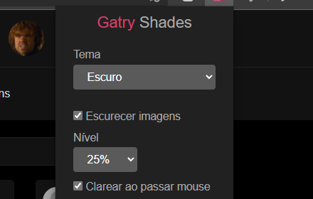
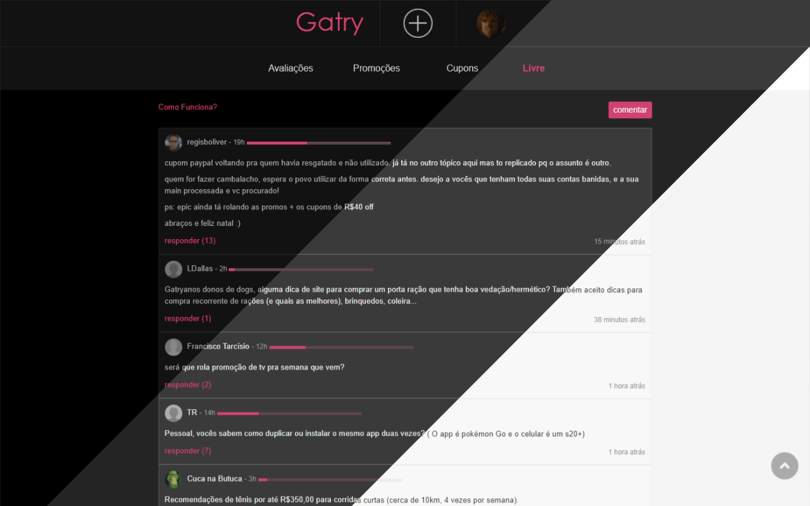
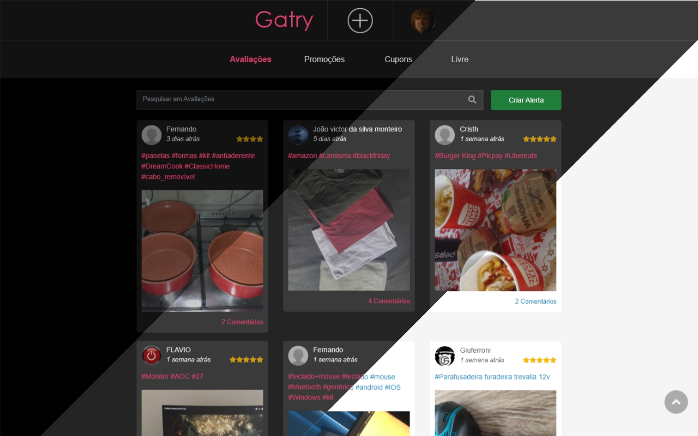

# Gatry Shades

Extensão que dá a possibilidade de aplicar temas ao site gatry.com, bem como demais funcionalidade para reduzir a luminosidade de imagens e demais componentes.

## Instalar
Atualmente compatível com **Firefox**, **Google Chrome** e **Microsoft Edge**.

[Clique aqui](https://addons.mozilla.org/pt-BR/firefox/addon/gatry-shades/) para instalar no Firefox. 

[Clique aqui](https://chrome.google.com/webstore/detail/gatry-shades/nmflikdijdboedbhmohgcaakjkniignj?hl=pt-BR) para instalar no Google Chrome.

[Clique aqui](https://chrome.google.com/webstore/detail/gatry-shades/nmflikdijdboedbhmohgcaakjkniignj?hl=pt-BR) para instalar no Microsoft Edge. 

## Capturas de Telas
Menu da extensão

Aba Promoções

Aba Livre

Aba Avaliações

